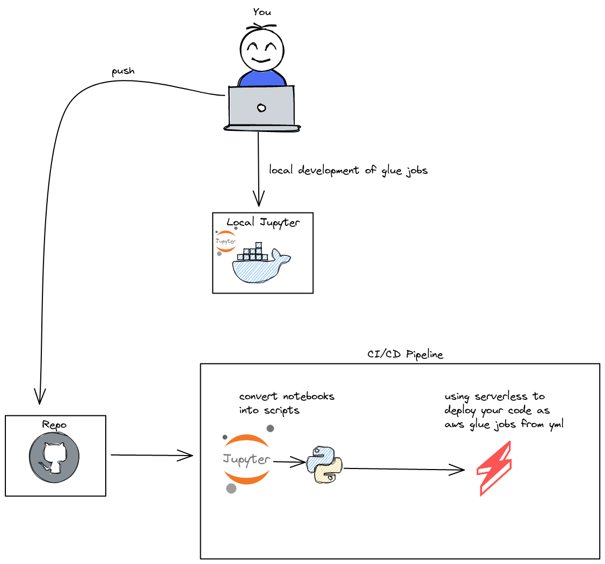

# A healthier workflow for using AWS Glue jobs

This repo consistis in my ideal workflow for overcoming some problems that AWS Glue jobs have, and It's an overhaul quality of life modifications that I use for working with this service.

## Workflow 


### The workflow consists in the following steps

* Write your aws glue job as a notebook on a local pyspark/jupyter container
* Push your changes or new notebook with some yml configs that will be used by [serverless](https://www.serverless.com/) on your github repo
* The push will trigger your CICD pipeline (AWS CodePipeline, Github Actions, Jenkins)
* In your pipeline, you will have to convert your notebook into python scripts, install the serverless framework and run the "serverless deploy" command.

## Running locally

### Initial setup

1. install docker
```sh
sudo apt install docker
```
2. install serverless 
```sh
npm install serverless
```
3. install serverless glue plugin
```sh
npm install serverless-glue
```
4. build the glue notebook image
```sh
docker build . -t notebook_glue
```
5. finally, you will need to have an aws cli configured with some credentials on ~/.aws

### To make the server up and running
```sh
docker run -d -p 8888:8888 -p 4040:4040 -p 4041:4041 -v $(pwd)/jobs:/home/jovyan/work:z -v ~/.aws:/home/jovyan/.aws --name glue notebook_glue
```
You can interact with your notebook server locally on localhost:8888

## Acknowledgements

* [Serverless](https://www.serverless.com/)
* [Serverless-glue](https://github.com/toryas/serverless-glue)
* [pyspark-notebook](https://jupyter-docker-stacks.readthedocs.io/en/latest/using/selecting.html#jupyter-pyspark-notebook)